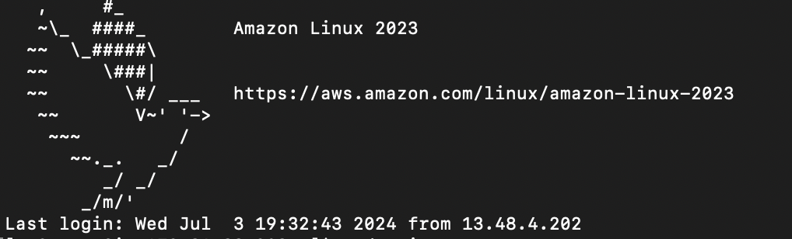
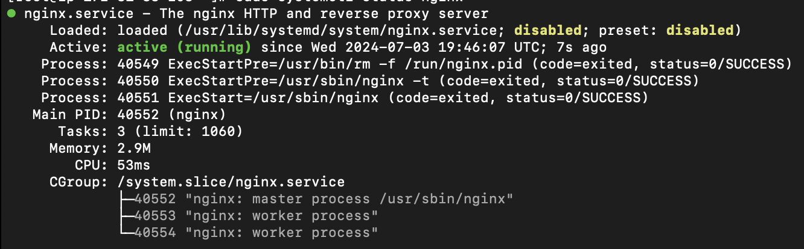

# Deploying Static Website using Apache Server and EC2 instance 
In this project we are deploying a simple website using AWS EC2 instance together with web server like Apache(httpd) or Nginx

## Creating an EC2 instance on AWS
- login to [AWS Console]()
- Go to EC2 then select launch instance 
- Enter the name of the instance, pick Amazon Linux Image, the free tier of AMI, t3.micro free tier, if you already have a key pair you can select or create a new one, the network setting you can have the inbound security to be http for port 80 and custom, can still have the ssh with port 22 (can have more than one security group) 
- launch instance 
- select the instance and click connect. You will either connect with ssh which will offer some commands linked to the key pair .pem or just connecting directly using EC2 instance connect which will open up a linux terminal 

## Connecting AWS EC2 Instance with Nginx 
I used Vagrant as my virtual machine 

`````
$ vagrant up 
$ chmod 400 'keypair.pem'
$ ssh -i 'keypair.pem' ec2-user@ec2-public-ip-address.compute.amazonaws.com
`````

`````
$ sudo -i
$ sudo yum update 
$ sudo yum install nginx
$ service nginx status
$ sudo systemctl start nginx
$ sudo systemctl status nginx.service

`````


the [public address](http://13.60.54.125) is now running on 


`````
$ cd /usr/share/nginx/html
$ cat index.html 
$ sudo nano index.html
$ sudo systemctl start nginx
$ sudo systemctl status nginx.service

`````


- I had a challenge using both httpd and Apache with much configuration in order to deploy a simple web folder with html, css and javascript code but i made changes to the default index.html of the nginx folder 

## Acknowledgment 

- I acknowledge [HNG Internship](https://hng.tech) for this challenge for DevOps. 